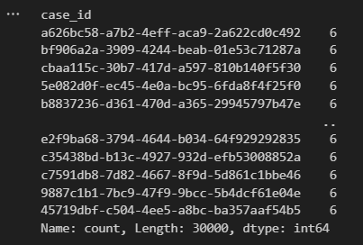

# Mineração de Processos: Análise para Seguradora de Carros

## Sobre:
Este projeto visa realizar descoberta de oportunidades, utilizando mineração de dados, a partir da análise de uma base de logs de eventos de uma seguradora de carros.

### Estrutura do Repositório:
* **data**: onde estarão os arquivos de dataset utilizados para a análise
* **notebook**: onde estarão os arquivos do tipo Jupyter Notebook, contendo a análise exploratória do dataset
* **presentation**: encontra-se o arquivo .ppt reunindo os principais insights da análise
* **presentation\images**: imagens capturadas durante a análise

### Linguagens, Bibliotecas e Ferramentas Utilizadas:
  

## Metodologia:

## Análise:

### Qualidade dos dados
Não foram identificados valores ausentes, valores estranhos ao dataset, nem outliers, que interferissem na distorção da análise. De forma geral, verificou-se um dataset bastante uniforme. Não foi necessária nenhuma ação de correção de erros no dataset.

<!-- Com o método .value_counts(), que faz a contagem de frequência dos valores únicos da variável declarada, e retorna por padrão os resultados em ordem descrescente, verificou-se quais variáveis possuíam distribuição com maior variação das frequências. 

Após essa verificação, os valores que apresentaram maior variação (adjuster_name, claimant_name, user_type, agent_name, claim_amount), foram plotados em histogramas. -->

<!-- Para os demais valores, que apresentaram pouca variação de frequências, optou-se por não explorar os dados. Como disclaimer, é válido ressaltar que em um cenário real para um dataset de logs de eventos, dificilmente encontra-se tamanha padronização e constância dos dados. Por exemplo, ao analisar a contagem dos valores únicos da coluna Case_ID, pôde-se verificar que todos os cases únicos possuem exatamente seis (6) atividades, indicando estabilidade e consistência no dataset.
   -->

## Conclusão:

## Links:
[Dataset no Kaggle](https://www.kaggle.com/datasets/carlosalvite/car-insurance-claims-event-log-for-process-mining?resource=download)